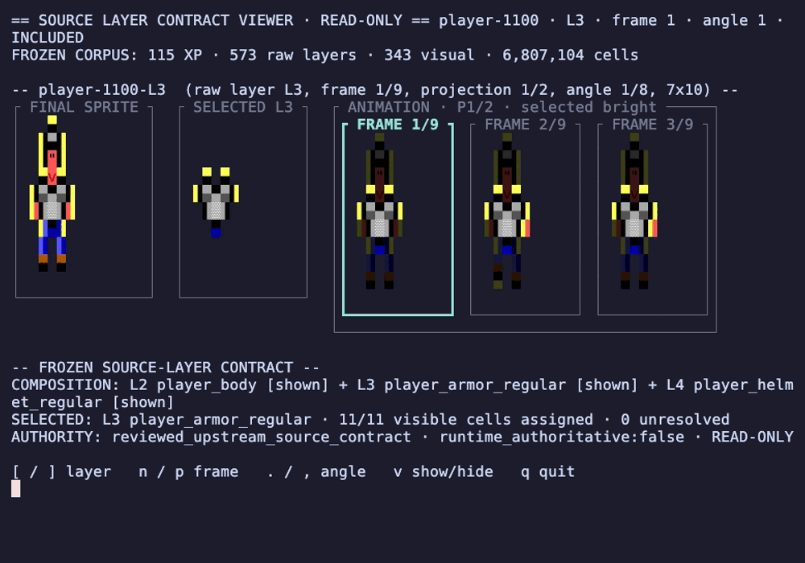
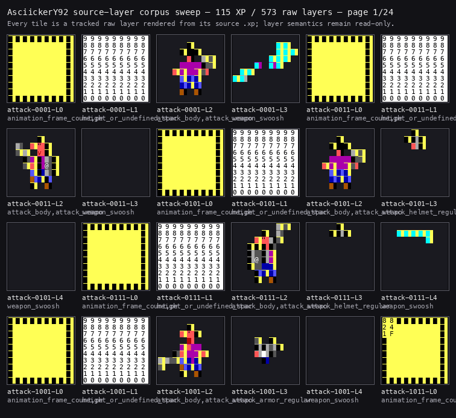

# AsciickerY92 Source Layer Contract Viewer

This is a standalone terminal viewer for the reviewed REXPaint `.xp` source
layers used by Asciicker Y9-2.

Use it when you need to see what is inside the sprite source files before the
runtime composes them: raw layers, reviewed cell roles, animation frames,
angles, projections, and the final composed preview. It is read-only, so it is
safe to use as an inspection tool without changing the sprite corpus or review
data.

## How an XP sprite becomes a layered sprite

REXPaint stores an XP sprite as a cell atlas with raw layers. In the Y9-2
source files, L0 is the color-key layer, L1 is the height/metadata layer,
L2 is the primary body accumulator, and L3+ are ordinal visual overlays such as
armor, helmet, or a weapon effect. The viewer preserves that raw-layer order
while showing a read-only inspection projection; it does not claim to compile
or author the runtime result.

The atlas has separate axes that must not be flattened. A **frame** is one time
position in the animation sequence. An **angle** is a directional row for that
frame. A **projection** is a front/rear (or equivalent) atlas view. A semantic
**body region** or role is a reviewed interpretation of selected cells on a
source layer. The final-sprite panel composes included visual layers, the
selected panel isolates the current raw layer, and the animation panel shows
the adjacent frame cells together. `n`/`p` moves frames, `.`/`,` moves angles,
`r` changes projection, and `v` demonstrates the display-only hide/show seam.

The review decisions and any hand-entered labels are historical review records.
They identify what was reviewed and why; the viewer reads them for inspection
but does not compile or mutate runtime data. The complete non-duplicating
inventory is in
[docs/historical-evidence/](docs/historical-evidence/).

The packaged corpus contains 115 reviewed XP files and 573 raw layers. The
viewer reads the layer decisions and cell-role data but cannot change them.





The focused GIF answers the main visual question: how do the reviewed source
layers compose into the final sprite? It opens the five-layer `player-1100`
asset, compares the armored composite with the selected armor or helmet layer,
and shows adjacent animation frames, angle/projection changes, hide/restore,
raw layer navigation, and navigation to another XP stem.

The corpus sweep renders every one of the 573 tracked raw layers across the 115
packaged XP files, one paged grid at a time. Use it to browse the whole
tracked source-layer corpus quickly.

## Run

For one non-interactive render:

```sh
./run-viewer.sh --once
```

Run without `--once` from a terminal for interactive navigation.

For the compact armored view shown in the recording:

```sh
./run-viewer.sh --source-key player-1100-L3 --compact
```

## What the viewer reads

- the packaged `.xp` sprite corpus
- source-layer review decisions
- per-family topology data
- reviewed cell roles

The viewer has no serialization or mutation path. It does not edit sprite files, assignments, anchors, semantic maps, or compiler/runtime state.

Excluded: `xp_core.py`, queues, comparison and coordinate-recording CLIs,
compilers, assignment saves, anchor editing, and semantic-map mutation.

See [docs/provenance.md](docs/provenance.md) for source identities, hashes, and
the visibility boundary. The reproducible capture recipe is stored
beside the GIF, and `./scripts/build-recording.sh` rebuilds the thirteen-state GIF.
Historical development records remain in
[docs/FAILURE_LOG.md](docs/FAILURE_LOG.md).
